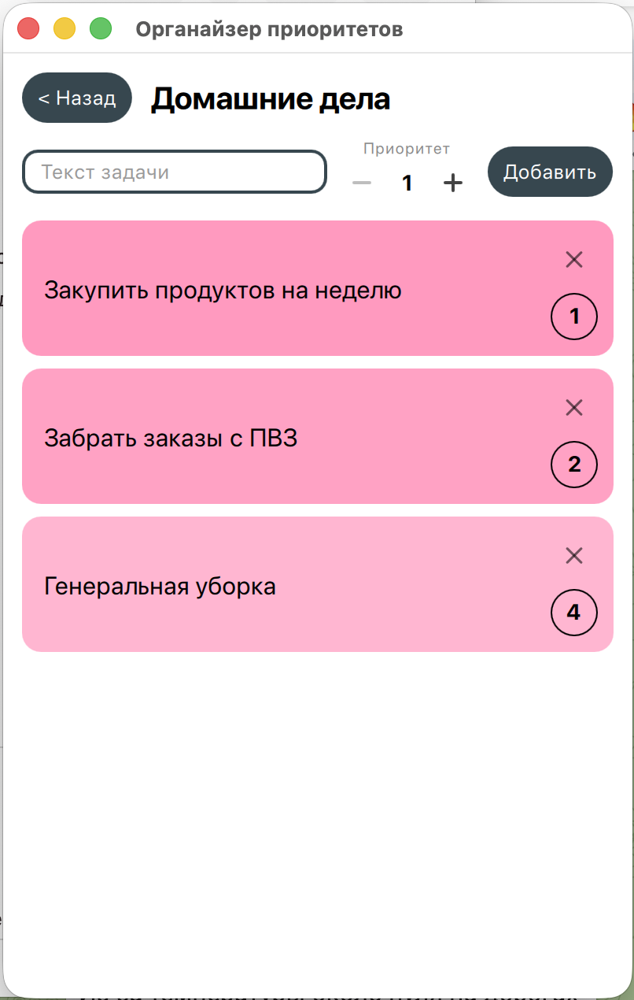
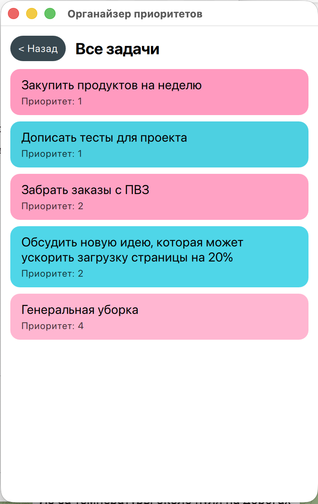

# Органайзер приоритетов

Мобильный органайзер задач для iOS на Qt/C++/QML — с несколькими именованными
списками, приоритетами внутри каждого и сводным экраном всех задач сразу.

Пет-проект для портфолио: часть логики (структуры данных, алгоритмы вставки
и слияния) спроектирована и реализована вручную, без использования готовых
высокоуровневых решений — как повод закрепить темы по алгоритмам и структурам
данных на практике.

---

## Скриншоты

| Список списков | Экран задач | Сводный список |
|---|---|---|
|  |  |  |


---

## Идея

- Несколько именованных списков (например, «Работа», «Домашние дела»), у
  каждого свой цвет.
- Внутри списка у задач есть приоритет (1 — самый высокий); список всегда
  отображается отсортированным по приоритету.
- Цвет задачи — градиент от цвета её списка, зависящий от приоритета.
- Сводный экран — все задачи из всех списков сразу, слитые в один
  отсортированный список.
- Данные сохраняются локально (JSON) и переживают перезапуск приложения.

## Возможности

- Создание, удаление и перекраска списков (кастомная палитра из
  сгенерированных цветов).
- Добавление, удаление и смена приоритета задач.
- Сводный экран по всем спискам сразу, с сортировкой по приоритету и
  тай-брейком по порядку списков.
- Локальное сохранение/загрузка (JSON), с восстановлением счётчиков id при
  загрузке, чтобы не было коллизий.
- Полностью самодельный минималистичный UI-kit (кнопки, поля ввода, выбор
  цвета и приоритета) поверх Qt Quick Controls — без «казённого» вида
  стандартных виджетов.

## Технологии

- **C++17** — ядро (структуры данных, бизнес-логика), не зависящее от Qt.
- **Qt 6 / Qt Quick (QML)** — UI и модели данных для отображения.
- **CMake** — сборка, включая кросс-компиляцию под iOS.
- **QJsonDocument** — сериализация в JSON для локального хранения.

## Архитектура

Проект разбит на слои с чёткой границей зависимостей:

```
task_item.h / task_item.cpp     ← ядро: TaskItem и операции над списком
                                   элементов. Чистый C++, ничего не знает о Qt.

task_list.h / task_list.cpp     ← ядро: TaskList, Organizer, слияние списков
                                   (k-way merge). Тоже чистый C++.

tasklistmodel.*                 ← Qt-модель одного списка для QML
organizermodel.*                ← Qt-модель списка списков для QML
summarymodel.*                  ← Qt-модель сводного экрана для QML
appcontroller.*                 ← точка входа для QML: владеет Organizer
                                   и всеми моделями, создаёт их по требованию

storage.h / storage.cpp         ← сохранение/загрузка Organizer в JSON

main.cpp                        ← точка входа приложения
main.qml                        ← весь UI
```

Ключевой принцип: **файлы ядра (`task_item.*`, `task_list.*`) не подключают
Qt** — это осознанное решение, чтобы бизнес-логику можно было переиспользовать
или протестировать независимо от UI-фреймворка. Вся Qt-специфика (модели,
роли, сигналы) — в отдельном слое поверх ядра.

## Алгоритмы и структуры данных

Пара решений, которые стоит отметить отдельно как результат осознанного
выбора между вариантами (а не «первое, что заработало»):

- **Вставка элемента с сохранением сортировки** — через `std::upper_bound`
  (бинарный поиск позиции, `O(log n)`) вместо полной пересортировки после
  каждой вставки.
- **Поиск и удаление по стабильному `id`, а не по индексу в массиве** — и
  для задач, и для списков: индекс/позиция меняются при любой другой
  операции, `id` — никогда.
- **Слияние всех списков в сводный список** — через k-way merge на основе
  `std::priority_queue` (min-heap), `O(N log k)`, где `N` — суммарное число
  задач, `k` — число списков, с тай-брейком по порядку списков при равном
  приоритете задач.
- **Пересчёт `rank` списков без дырок** при удалении — вместо полной
  пересортировки, только сдвиг `rank` тех списков, что шли после удалённого.

## Структура проекта

```
OrganizerApp/
├── CMakeLists.txt
├── main.cpp
├── main.qml
├── task_item.h / task_item.cpp
├── task_list.h / task_list.cpp
├── tasklistmodel.h / tasklistmodel.cpp
├── organizermodel.h / organizermodel.cpp
├── summarymodel.h / summarymodel.cpp
├── appcontroller.h / appcontroller.cpp
├── storage.h / storage.cpp
└── screenshots/
```

## Сборка и запуск

### Desktop (macOS)

1. Открой `CMakeLists.txt` в Qt Creator как проект.
2. Выбери Kit под свою десктопную Qt-версию.
3. Собери и запусти (⌘R).

### iOS

1. Установи компоненты iOS через Qt Online Installer, если ещё не стоят.
2. Установи Xcode из App Store, прими лицензионное соглашение.
3. Добавь iOS Kit в проект (Projects → Build & Run → Kits).
4. Настрой подпись (Team — свой Apple ID) в настройках Run для iOS Kit.
5. Выбери подключённый iPhone или симулятор как цель запуска.

## Статус проекта

В работе / запланировано:

- [ ] Тестирование и полировка на реальном iOS-устройстве.
- [ ] Более плавный UX смены приоритета (сейчас список мгновенно
      пересортировывается при каждом шаге — работает корректно, но может
      сбивать с толку при близких приоритетах).
- [ ] Переупорядочивание списков (drag-and-drop).
- [ ] Уведомления о дедлайнах.

## Автор

<!-- https://github.com/SmoozyKara/ -->
